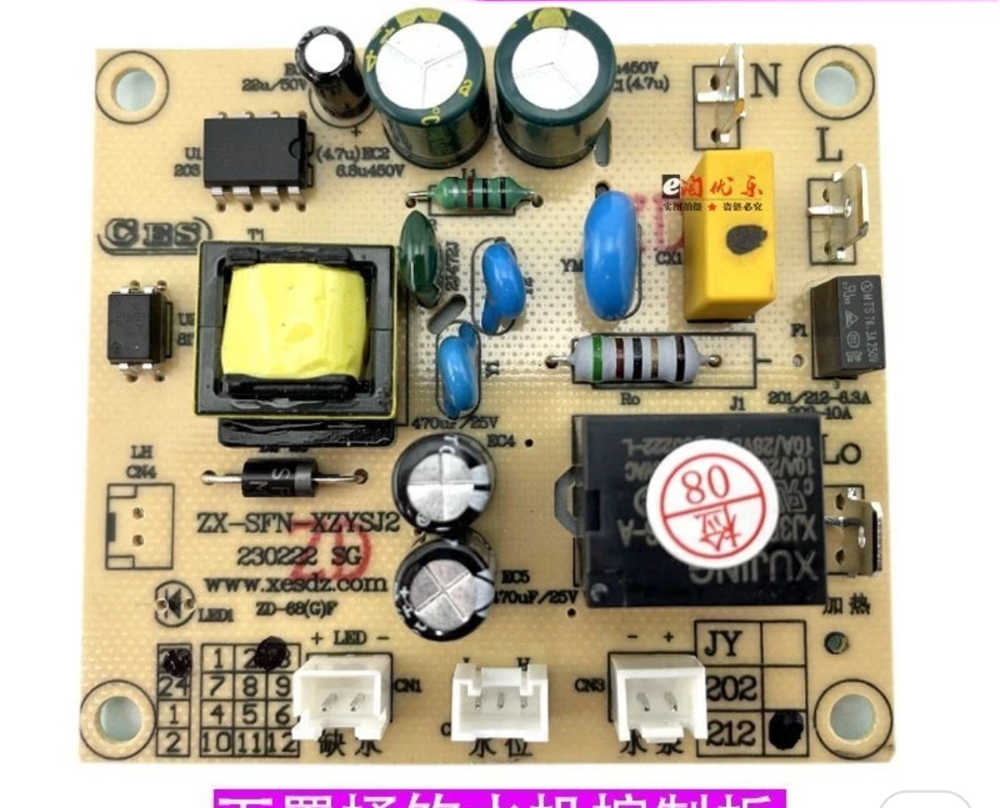

# Firmware Dispenser Controller

Firmware untuk kontrol otomatis dispenser air dengan ESP8266/ESP32. Mengontrol pompa air, heater, dan deteksi level air secara otomatis.

## Fitur

- Kontrol pompa air otomatis berdasarkan sensor level air
- Kontrol heater otomatis (aktif hanya saat air cukup)
- Deteksi galon kosong (timer 5 menit)
- LED indikator berkedip saat galon kosong atau error
- Log serial untuk monitoring dan debugging
- Support ESP8266 dan ESP32

## Hardware Requirements

- ESP8266 (ESP-12E) atau ESP32
- Relay module 2 channel (untuk pompa dan heater)
- Water level sensor (Float Switch atau Reed Switch)
- LED indikator (opsional)
- Power supply sesuai kebutuhan

### Controller Original (Bawaan)



*Gambar di atas adalah controller original (bawaan) dispenser yang menjadi referensi untuk pengembangan firmware ini.*

## Pin Mapping

### ESP8266 (Default)
- GPIO4 (Pin 14): Relay Heater
- GPIO5 (Pin 13): LED Water Empty (Red Wire)
- GPIO2 (Pin 5): Built-in LED
- GPIO12 (Pin 12): Sensor Water Level (Brown Wire)
- GPIO13 (Pin 16): Relay Pump

### ESP32
- GPIO16: Relay Heater
- GPIO17: LED Water Empty
- GPIO18: Sensor Water Level
- GPIO19: Relay Pump

## Wiring

### Relay Module
- Gunakan terminal NO (Normally Open) untuk fail-safe
- HEATER: COM -> Sumber listrik, NO -> Heater
- POMPA: COM -> Sumber listrik, NO -> Pompa

### Sensor Air
- Terminal 1 -> GND
- Terminal 2 -> SENSOR_WATER_LEVEL_PIN
- Pin menggunakan INPUT_PULLUP (internal pull-up)

**Cara Kerja Sensor:**
- Air PENUH: Switch tertutup ke GND -> Pin LOW -> waterOk = true
- Air KOSONG: Switch terbuka -> Pin HIGH -> waterOk = false

## Konfigurasi

Edit `src/main.cpp` untuk mengubah konfigurasi:

```cpp
const bool SENSOR_ACTIVE_LOW = true;  // true jika switch ke GND saat penuh
const unsigned long GALLON_EMPTY_DETECT_MS = 300000;  // 5 menit
const unsigned long LED_BLINK_INTERVAL_MS = 500;  // 500ms
```

## Build dan Upload

### ESP8266 (Default)
```bash
pio run -e esp8266
pio run -e esp8266 -t upload
pio device monitor -e esp8266
```

### ESP32
```bash
pio run -e esp32dev
pio run -e esp32dev -t upload
```

## Logika Kerja

### Pompa
- **BEKERJA jika:** Air di tank kurang/kosong DAN galon masih ada
- **BERHENTI jika:** 
  - Sensor mendeteksi air penuh (prioritas tertinggi)
  - Galon kosong terdeteksi (pompa > 5 menit tapi air masih kurang)

### Heater
- **AKTIF jika:** Air di tank sudah cukup
- **MATI jika:** Air kurang atau galon kosong

### Deteksi Galon Kosong
- Timer mulai saat pompa aktif dan air masih kurang
- Timer di-reset otomatis jika sensor mendeteksi air penuh
- Jika timer mencapai 5 menit tanpa air penuh, galon kosong terdeteksi
- LED akan berkedip sebagai indikasi

### LED Indikator
- Berkedip saat galon kosong terdeteksi
- Berkedip saat error (jika ada)
- Mati saat kondisi normal

## Serial Monitor

Firmware mengirim log serial dengan format:
- [PLATFORM] Platform yang digunakan
- [PIN] Konfigurasi pin
- [PUMP] Status pompa ON/OFF
- [HEATER] Status heater ON/OFF
- [WATER] Status level air OK/LOW
- [TIMER] Status timer deteksi galon kosong
- [ALERT] Peringatan galon kosong
- [INFO] Informasi status

Baud rate: 115200

## Catatan Penting

1. Sensor water memiliki prioritas tertinggi - selalu memvalidasi dan menghentikan pompa jika air sudah penuh
2. Timer deteksi galon kosong hanya sebagai backup jika sensor tidak mendeteksi penuh
3. Gunakan relay dengan terminal NO untuk fail-safe
4. Pastikan sensor terhubung dengan benar (test dengan mengubah SENSOR_ACTIVE_LOW jika logika terbalik)
